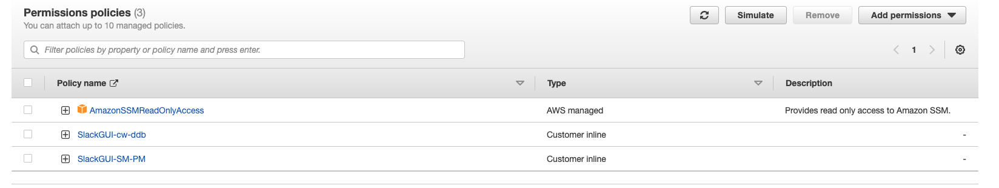

<h1><b>SLACKBOT UserForm GUI</b></h1>

<i>VERSION UPDATE: Remove the create terrafrom.tfvar file GitHub functionalities  from the previous version.</i>

The app is providing a user-friendly GUI application form with input text boxes, drop-down menus and buttons to insert user information. Once submit the data it will store directly in the dynamodb table 
with help of a lambda function.
<br />


<h2>Local setup</h2> <br />

**Creating the virtual environment**
    sudo yum install python3 python3-venv

    mkdir .venv
    python3 -m venv .venv
    source .venv/bin/activate   (type "deactivate" to deactivate the env)

**Install all dependencies** 
    > pip install --upgrade pip
    > pip install slackclient slackeventsapi Flask
    > pip3 install boto3
    > pip3 install slack_bolt
    > python -m pip install requests
    > pip install GitPython


**creae your slack app and get following details for env file**
export SLACK_APP_TOKEN=
export SLACK_BOT_TOKEN=
export SLACK_SIGNING_SECRET=

**Before dockersing the code required to create the requirement file**
    pip3 freeze > requirements.txt
**Create the Docker file in the root directory**
    Dockerfile
    ```
        FROM python:3.8

        <!-- Creating the working dir in the container -->
        WORKDIR /bolt-app       

        <!-- copying the requirment.txt file into the container -->
        COPY requirements.txt.

        <!-- Installing the dependencies via requirements file -->
        RUN pip install -r requirements.txt

        <!-- copying the local app folder to the root folder  -->
        COPY ./app ./app

        <!-- setting startup file to run -->
        CMD ["python", "./app/main-onramp.py"]


***When you test in the local docker container use the folowing steps (optional)***
    
    <!-- build docker image  -->
    docker build -t slackbot-gui-ecs .

    <!-- run the docker container -->
    docker run -it -e SLACK_APP_TOKEN=<SLACK-APP-TOKEN> \
    -e SLACK_BOT_TOKEN=<SLACK-BOT-TOKEN> \
    -e SLACK_SIGNING_SECRET=<SLACK-SIGNING-SECRET> \
    -t slackbot-gui-ecs

    

***when you need to push an image to aws ecr use the following steps***
    go back to root directory(come out from app folder if you are in)
    create a AWS ecr public repo 
    then follow the push commands to push your code and docker file
    copy the uri for the created image


***create the ECR and push files to the repo***
        aws ecr get-login-password --region eu-west-2 | docker login --username AWS --password-stdin <your-account-id>.dkr.ecr.eu-west-2.amazonaws.com
        docker build -t <cluster-name> .                                                                                                      
        docker tag slackbot-gui:latest <your-account-id>.dkr.ecr.eu-west-2.amazonaws.com/<cluster-name>:latest  
        docker push <your-account-id>.dkr.ecr.eu-west-2.amazonaws.com/<cluster-name>:latest                                                        


***Create IAM Role - ECS-SlackBot***

    create a ECS-SlackBot iam role (4 plocies (2 inline and 2 aws managed) ) which can have access to parameterstore , cw logs etc.. ( ECS admin and access to parameter store)
```
        Customer inline policy - slackbot-gui-cw-ddb ->
                    {
                "Version": "2012-10-17",
                "Statement": [
                    {
                        "Effect": "Allow",
                        "Action": "logs:CreateLogGroup",
                        "Resource": "arn:aws:logs:eu-west-2:536371856221:*"
                    },
                    {
                        "Effect": "Allow",
                        "Action": [
                            "logs:CreateLogStream",
                            "logs:PutLogEvents"
                        ],
                        "Resource": "arn:aws:logs:eu-west-2:536371856221:log-group:/aws/lambda/slackbot-gui:*"
                    },
                    {
                        "Effect": "Allow",
                        "Action": "dynamodb:*",
                        "Resource": "arn:aws:dynamodb:eu-west-2:536371856221:table/onrampclient"
                    }
                ]
            }

        AmazonECSTaskExecutionRolePolicy ->
                            {
                    "Version": "2012-10-17",
                    "Statement": [
                        {
                            "Effect": "Allow",
                            "Action": [
                                "ecr:GetAuthorizationToken",
                                "ecr:BatchCheckLayerAvailability",
                                "ecr:GetDownloadUrlForLayer",
                                "ecr:BatchGetImage",
                                "logs:CreateLogStream",
                                "logs:PutLogEvents"
                            ],
                            "Resource": "*"
                        }
                    ]
                }

        AmazonSSMReadOnlyAccess ->
                {
                "Version": "2012-10-17",
                "Statement": [
                    {
                        "Effect": "Allow",
                        "Action": [
                            "ssm:Describe*",
                            "ssm:Get*",
                            "ssm:List*"
                        ],
                        "Resource": "*"
                    }
                ]
            }

    Customer inline policy - slackParamaterStoreAccess ->
            {
                    "Version": "2012-10-17",
                    "Statement": [
                        {
                            "Effect": "Allow",
                            "Action": [
                                "secretsmanager:GetSecretValue",
                                "ssm:GetParameters",
                                "kms:Decrypt"
                            ],
                            "Resource": [
                                "arn:aws:ssm:eu-west-2:536371856221:parameter/SLACK_APP_TOKEN",
                                "arn:aws:ssm:eu-west-2:536371856221:parameter/SLACK_BOT_TOKEN",
                                "arn:aws:ssm:eu-west-2:536371856221:parameter/SLACK_SIGNING_SECRET"
                            ]
                        }
                    ]
                }

```    


***Create Paramater Store toekns*** <br />
```
    SLACK_APP_TOKEN <br />
    SLACK_BOT_TOKEN <br />
```

***create ECS cluster -  fargate - add ECS-SlackBot role*** <br />
***create a fargate task definition***
```
    Attached the created role ECS-SlackBot and ECR repo image uri - ref:(https://www.youtube.com/watch?v=-Vsuzi4OByY&ab_channel=DenysonData)
    run the task - make sure your sg inbound configured to 80
    
    Run the task     
    note: if fail to run , check your paramater store permision for the role or values of the parameters.

    CLI command for stopping a running task
        aws ecs stop-task --cluster "Slackbot-gui" --task "84c5a8610c7b4cf8b8ae6db1a13cf1fe" --region "eu-west-2"
            Note: command will not work for an inactive task
```            


***S3 setup***
```
    create s3 bucket onrampbot
    Create a DDB table 'rampbot' and partition key 'awsid'
    run 'python3 ./app/main.py' 
```
***DDB setup***
```    create ddb table "rampbot"
    partition key "awsid"
```

***Slack app setup***
```
    display_information:
    name: OnRampBot
    features:
    bot_user:
        display_name: OnRampBot
        always_online: false
    shortcuts:
        - name: Onramp request
        type: global
        callback_id: onramp
        description: aws lambda requests
    slash_commands:
        - command: /add
        description: Insert the client deatils
        should_escape: false
    oauth_config:
    scopes:
        bot:
        - channels:history
        - chat:write
        - groups:history
        - im:history
        - mpim:history
        - incoming-webhook
        - commands
    settings:
    event_subscriptions:
        bot_events:
        - message.channels
        - message.groups
        - message.im
        - message.mpim
    interactivity:
        is_enabled: true
    org_deploy_enabled: false
    socket_mode_enabled: true
    token_rotation_enabled: false
```

Note: make sure Socket Mode enable 


